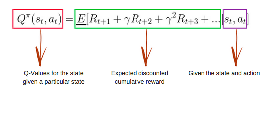

# Gym Taxi V3 - Reinforcement Learning AI


### Description of the project

There are four designated pick-up and drop-off locations (Red, Green, Yellow and Blue) in the 5x5 grid world. The taxi starts off at a random square and the passenger at one of the designated locations.

The goal is move the taxi to the passenger’s location, pick up the passenger, move to the passenger’s desired destination, and drop off the passenger. Once the passenger is dropped off, the episode ends.

The player receives positive rewards for successfully dropping-off the passenger at the correct location. Negative rewards for incorrect attempts to pick-up/drop-off passenger and for each step where another reward is not received.

### Observation Space
There are 500 discrete states since there are 25 taxi positions, 5 possible locations of the passenger (including the case when the passenger is in the taxi), and 4 destination locations. Destination on the map are represented with the first letter of the color :

**Passenger locations:**

    0: Red
    1: Green
    2: Yellow
    3: Blue
    4: In taxi

**Destinations:**

    0: Red
    1: Green
    2: Yellow
    3: Blue

### Rewards

To train our model we will use rewards

    -1 per step unless other reward is triggered.
    +20 delivering passenger.
    -10 executing “pickup” and “drop-off” actions illegally.

### Used algorithm

**Q-learning algorithm**

Q-learning is a model-free, value-based, off-policy algorithm that will find the best series of actions based on the agent's current state. The “Q” stands for quality. Quality represents how valuable the action is in maximizing future rewards.  

The model-based algorithms use transition and reward functions to estimate the optimal policy and create the model. In contrast, model-free algorithms learn the consequences of their actions through the experience without transition and reward function. 

The value-based method trains the value function to learn which state is more valuable and take action. On the other hand, policy-based methods train the policy directly to learn which action to take in a given state.

**Key Terminologies**

- States(s): the current position of the agent in the environment. 
- Action(a): a step taken by the agent in a particular state. 
- Rewards: for every action, the agent receives a reward and penalty. 
- Episodes: the end of the stage, where agents can’t take new action. It happens when the agent has achieved the goal or failed. 
- Q(St+1, a): expected optimal Q-value of doing the action in a particular state. 
- Q(St, At): it is the current estimation of Q(St+1, a).
- Q-Table: the agent maintains the Q-table of sets of states and actions.
- Temporal Differences(TD): used to estimate the expected value of Q(St+1, a) by using the current state and action and previous state and action. 

**Q-Table**

The agent will use a Q-table to take the best possible action based on the expected reward for each state in the environment. In simple words, a Q-table is a data structure of sets of actions and states, and we use the Q-learning algorithm to update the values in the table. 

**Q-Function**

The Q-function uses the Bellman equation and takes state(s) and action(a) as input. The equation simplifies the state values and state-action value calculation. 



**Q-learning algorithm**


### Training steps

**1. Initialize Q-Table**

We will first initialize the Q-table. We will build the table with columns based on the number of actions and rows based on the number of states.

**2. Choose an Action**

The second step is quite simple. At the start, the agent will choose to take the random action(down or right), and on the second run, it will use an updated Q-Table to select the action.

**3. Perform an Action**

Choosing an action and performing the action will repeat multiple times until the training loop stops. The first action and state are selected using the Q-Table.

**4. Measuring the Rewards**

After taking the action, we will measure the outcome and the reward. 

- The reward for reaching the goal is +1
- The reward for taking the wrong path (falling into the hole) is 0
- The reward for Idle or moving on the frozen lake is also 0. 

**5. Update Q-Table**

We will update the function Q(St, At) using the equation. It uses the previous episode’s estimated Q-values, learning rate, and Temporal Differences error. Temporal Differences error is calculated using Immediate reward, the discounted maximum expected future reward, and the former estimation Q-value. 

The process is repeated multiple times until the Q-Table is updated and the Q-value function is maximized.

### Observations after training

We trained our model on a total of 20 000 episodes

```python
training_episodes = 20000
```

After testing the result is :

```python
Results after 10 episodes:
Average timesteps per episode: 11.4
Average penalties per episode: 0.0
```

As we can sett the results are really good